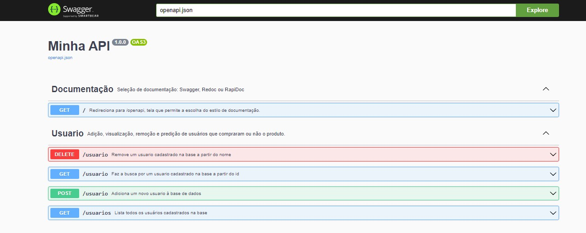
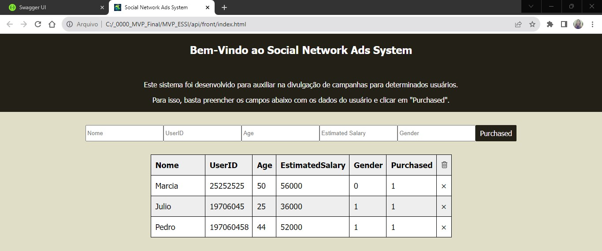
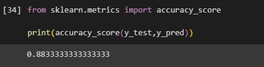

# MVP: Prática de Machine Learning em Python 

O objetivo do projeto é criar um modelo (Machine Learning - Back end e Front end) onde usuários que viram anúncio em mídia social e se compraram ou não o produto. (0 = Não comprou e 1 = comprou).

Modelo: ESSI_SN_ADS.ipynb

Front end - Back end e teste : pasta api

## Como executar

Será necessário ter todas as libs python listadas no requirements.txt instaladas. Após clonar o repositório, é necessário ir ao diretório raiz, pelo terminal, para poder executar os comandos descritos abaixo.

(env)$ pip install -r requirements.txt

Este comando instala as dependências/bibliotecas, descritas no arquivo requirements.txt.

Para executar a API basta executar:

(env)$ flask run --host 0.0.0.0 --port 5000

Em modo de desenvolvimento é recomendado executar utilizando o parâmetro reload, que reiniciará o servidor automaticamente após uma mudança no código fonte.

(env)$ flask run --host 0.0.0.0 --port 5000 --reload

Abra o http://localhost:5000/#/ no navegador para verificar o status da API em execução.

## Principais Insights:

Apresentação do Swagger com todas as rotas apresentadas:

Interação com o Front end:

No modelo de Machine Learning tivemos uma acurácia de 88%:

